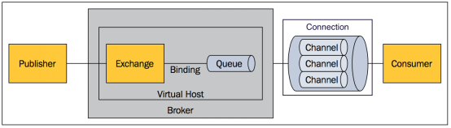

# RabbitMQ

## 一、RabbitMQ模型介绍

### 1.1、内部结构分析

RabbitMQ 本质是 AMQP 协议的一个开源实现，在详细介绍 RabbitMQ 之前，我们先来看一下 AMQP 的内部结构图！



**基本概念如下**：

- **Publisher**：消息的生产者，也是一个向交换器发布消息的客户端应用程序
- **Exchange**：交换器，用来接收生产者发送的消息并将这些消息路由给服务器中的队列
- **Binding**：绑定，**用于将消息队列和交换器之间建立关联**。一个绑定就是基于路由键将交换器和消息队列连接起来的路由规则，所以可以将它理解成一个由绑定构成的路由表。
- **Queue**：消息队列，用来保存消息直到发送给消费者
- **Connection**：网络连接，比如一个 TCP 连接
- **Channel**：信道，多路复用连接中的一条独立的双向数据流通道
- **Consumer**：消息的消费者，表示一个从消息队列中取得消息的客户端应用程序
- **Virtual Host**：虚拟主机，表示一批交换器、消息队列和相关对象。虚拟主机是共享相同的身份认证和加密环境的独立服务器域。每个 vhost 本质上就是一个 mini 版的 RabbitMQ 服务器，拥有自己的队列、交换器、绑定和权限机制。vhost 是 AMQP 概念的基础，必须在连接时指定，RabbitMQ 默认的 vhost 是 `/`
- **Broker**：表示消息队列服务器实体
- **Message**：消息实体，它由消息头和消息体组成。消息头主要由**路由键、交换器、队列、priority（相对于其他消息的优先权）、delivery-mode（指出该消息可能需要持久性存储）等属性**组成，而消息体就是指具体的业务对象

相比传统的 JMS 模型，AMQP 主要多了 **Exchange**、**Binding** 这个新概念。

在 AMQP 模型中，消息的生产者不是直接将消息发送到`Queue`队列，而是将消息发送到`Exchange`交换器，其中还新加了一个中间层`Binding`绑定，作用就是通过`路由键Key`将交换器和队列建立绑定关系。


就好比类似**用户表**和**角色表**，中间通过**用户角色表**来将用户和角色建立关系，从而实现关系绑定，在 RabbitMQ 中，消息生产者不直接跟队列建立关系，而是将消息发送到交换器之后，由交换器通过已经建立好的绑定关系，将消息发送到对应的队列！

RabbitMQ 最终的架构模型，核心部分就变成如下图所示：


从图中很容易看出，与 JMS 模型最明显的差别就是消息的生产者不直接将消息发送给队列，而是由`Binding`**绑定**决定交换器的消息应该发送到哪个队列，进一步实现了在消息的推送方面，更加灵活！

### 1.2、交换器分发策略

当消息的生产者将消息发送到交换器之后，是不会存储消息的，而是通过中间层绑定关系将消息分发到不同的队列上，其中交换器的分发策略分为四种：Direct、Topic、Headers、Fanout！

- **Direct**：直连类型，即在绑定时设定一个 routing_key, 消息的 routing_key 匹配时, 才会被交换器投送到绑定的队列中去，原则是**先匹配、后投送**；
- **Topic**：按照规则转发类型，支持通配符匹配，和 Direct 功能一样，但是在匹配 routing_key的时候，更加灵活，支持通配符匹配，原则也是**先匹配、后投送**；
- **Headers**：头部信息匹配转发类型，根据消息头部中的 header attribute 参数类型，将消息转发到对应的队列，原则也是**先匹配、后投送**；
- **Fanout**：广播类型，将消息转发到所有与该交互机绑定的队列上，不关心 routing_key；

#### 1.2.1、Direct

Direct 是 RabbitMQ 默认的交换机模式，也是最简单的模式，消息中的路由键（routing key）如果和 Binding 中的 binding key 一致， 交换器就将消息发到对应的队列中。

如果传入的 routing key 为 `black`，不会转发到`black.green`。Direct 类型交换器是**完全匹配、单播的模式**。


#### 1.2.2、Topic

Topic 类型交换器转发消息和 Direct 一样，不同的是：它支持通配符转发，相比 Direct 类型更加灵活！

两种通配符：`*`只能匹配一个单词，`#`可以匹配零个或多个。

如果传入的 routing key 为 `black#`，不仅会转发到`black`，也会转发到`black.green`。


#### 1.2.3、Headers

headers 也是根据规则匹配, 相比 direct 和 topic 固定地使用 routing_key , headers 则是通过一个自定义匹配规则的消息头部类进行匹配。

在队列与交换器绑定时，会设定一组键值对规则，消息中也包括一组键值对( headers 属性)，当这些键值对有一对, 或全部匹配时，消息被投送到对应队列。

此外 headers 交换器和 direct 交换器完全一致，但性能差很多，目前几乎用不到了。


#### 1.2.4、Fanout

Fanout  类型交换器与上面几个不同，**不管路由键或者是路由模式，会把消息发给绑定给它的全部队列**，如果配置了 routing_key 会被忽略，也被成为消息广播模式。很像子网广播，每台子网内的主机都获得了一份复制的消息

fanout 类型转发消息在四种类型中是最快的。


## 二、RabbitMQ 安装

本地采用的是docker安装，下载镜像，执行命令：

````shell
docker run -d --name rabbitmq -p 5672:5672 -p 15672:15672 -v /usr/local/docker/rabbitmq/data:/var/lib/rabbitmq --hostname myRabbit -e RABBITMQ_DEFAULT_VHOST=amq_vhost -e RABBITMQ_DEFAULT_USER=admin -e RABBITMQ_DEFAULT_PASS=admin f65f7c36d41b
````

可视化管理界面：http://172.16.33.69:15672/

.jpg)

### 三、Spring Boot整合使用