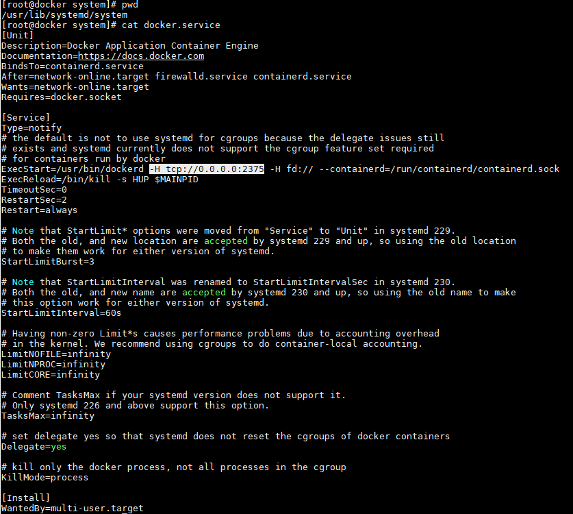
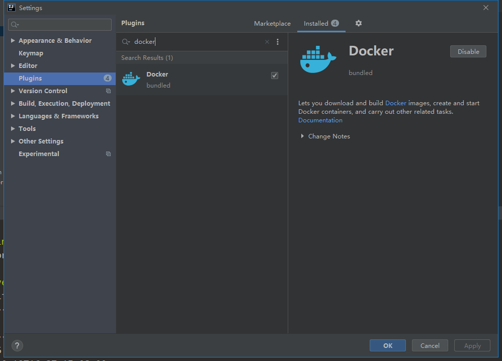
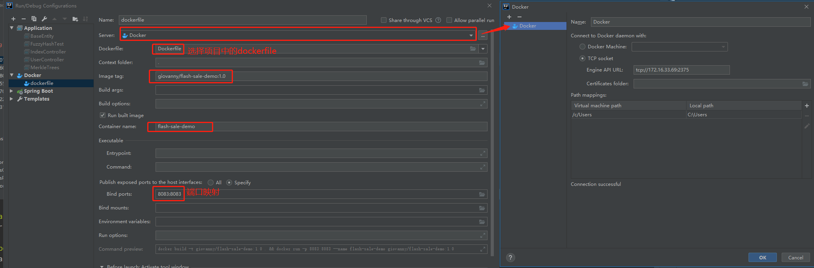
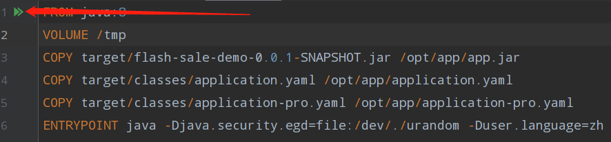

# 商品秒杀DEMO-flash-sale-demo

**商品库存PO**，数据库表列有以下字段及id字段，id字段为了简便就用的数据库自增

```java
@Data
public class Stock extends BaseEntity {

    /**
     * 名字
     */
    private String name;

    /**
     * 库存
     */
    private Long stock;

    private String version;
    
}
```
**controller**

主要关注/flash/sale/order这个请求，收到订单请求后调用service处理
```java
@RestController
@RequestMapping("flash/sale")
public class StockController {
    @Autowired
    private IStockService stockService;

    @PostMapping(path = "order")
    public String flashSale(Long goodsId, Integer count) {
        boolean isOrder = stockService.goodsOrder(goodsId, count);
        if (isOrder) {
            return "success";
        } else {
            return "此商品秒杀结束";
        }
    }

    @GetMapping(path = "test")
    public String test() {
        try {
            stockService.addGoods();
        } catch (Exception e) {
            e.printStackTrace();
        }
        return "success";
    }
}
```
**service**

此处省略接口直接贴实现类。首先查询商品库存，订单订购商品数量与库存对比判断是否可以下单，可以即发送消息

这里为了简单就用的Redis作为消息队列，开发中可以用较专业成熟的RabbitMQ作为消息队列
```java
@Service
@Slf4j
public class StockServiceImpl extends ServiceImpl<StockMapper, Stock> implements IStockService {

    @Autowired
    private StockMapper stockMapper;
    @Autowired
    private RedisTemplate<String, Object> redisTemplate;
    @Override
    public boolean goodsOrder(Long goodsId, Integer count) {
        HashOperations<String, Object, Object> opsForHash = redisTemplate.opsForHash();
        Integer stock = (Integer) opsForHash.get(StockInit.GOODS_STOCK_KEY, goodsId);
        if (stock == null) {
            log.info("redis 此商品[{}]秒杀已结束。stock:{}", goodsId, stock);
            return false;
        }
        if (stock <= 0 || stock < count) {
            log.info("redis 库存已不充足。stock:{},count:{}", stock, count);
            return false;
        }
        Long lastStock = opsForHash.increment(StockInit.GOODS_STOCK_KEY, goodsId, -count);
        log.info("剩余库存 lastStock:{}", lastStock);
        Map<String, Object> map = new HashMap<>(8);
        map.put("id", goodsId);
        map.put("count", count);
        redisTemplate.convertAndSend("redis-topic", map);
        return true;
    }

    @Override
    public void countDown(Long goodsId, Integer count) {
        stockMapper.countDownStock(goodsId, count);
    }
}
```
**项目启动时会初始化商品库存到Redis**，保存成hash,key:商品ID，value:商品库存 

如：["1":100,"2":100],

设置秒杀时间为5分钟

根据实际情况可以变化初始化库存到redis的操作，多节点的时候，这个是初始化可能需要去抢锁，只允许一个节点初始化或者怎么分配初始化。

```java
@Component
@Slf4j
public class StockInit implements InitializingBean {
    @Autowired
    private IStockService stockService;
    @Autowired
    private RedisTemplate<String, Object> redisTemplate;

    public final static String GOODS_STOCK_KEY = "GOODS_STOCK_KEY";

    @Override
    public void afterPropertiesSet() throws Exception {
        log.info("----初始化商品库存，将MySQL中的商品库存保存到Redis");
        Map<Long, Long> stockMap = stockService.list()
                .parallelStream()
                .collect(Collectors.toMap(Stock::getId, Stock::getStock));
        HashOperations<String, Object, Object> opsForHash = redisTemplate.opsForHash();
        opsForHash.putAll(GOODS_STOCK_KEY, stockMap);
        redisTemplate.expire(GOODS_STOCK_KEY, 5, TimeUnit.MINUTES);
    }
}
```
消息监听。获取队列消息，排队处理，并生成订单，减少MySql中的库存数量

TODO：打算用websocket的方式将秒杀下单成功的消息推送给用户
```java
@Service
@Slf4j
public class Receiver implements MessageListener {
    @Autowired
    private StockServiceImpl stockService;

    @Override
    public void onMessage(Message message, byte[] pattern) {
        // redis队列的方式不是很好 很容易丢失消息，也可能是我没有配置好，感觉用rabbitmq会好一点
        log.info("message:{}", message);
        log.info("pattern:{}", pattern);
        //减库存，生成订单
        String msg = message.toString();
        JSONObject object = JSONObject.parseObject(msg);
        Integer goodsId = (Integer) object.get("id");
        Integer count = (Integer) object.get("count");
        stockService.countDown(Long.valueOf(goodsId), count);
    }
}
```
简单减少库存的SQL
```sql
<update id="countDownStock">
    update stock
    set stock=stock - #{count}
    where id=#{goodsId}
</update>
```

#  idea-docker一键部署

## 一、Linux版docker配置：

修改**docker.service**文件：

在/usr/lib/systemd/system路径下增加如下图选中内容，然后重启docker



重启docker：

```shell
 systemctl daemon-reload
 systemctl restart docker
```

## 二、idea安装插件



## 三、编写dockerfile

````dockerfile
FROM java:8
VOLUME /tmp
COPY target/flash-sale-demo-0.0.1-SNAPSHOT.jar /opt/app/app.jar
COPY target/classes/application.yaml /opt/app/application.yaml
COPY target/classes/application-pro.yaml /opt/app/application-pro.yaml
ENTRYPOINT java -Djava.security.egd=file:/dev/./urandom -Duser.language=zh -Duser.region=CN -Dfile.encoding=UTF-8 -Duser.timezone=Asia/Shanghai -Duser.country=CN -Do2o.profile=dev -Do2o.home=/opt/app -Xmx1024m -Xms1024m -Xmn512m -jar /opt/app/app.jar --spring.config.additional.location=application.yaml
````

没有直接申明使用哪个配置文件（dev/prod/test），因为spring boot部署运行时加载配置文件有一定的优先级，优先加载resources下的application.properties ->application.yaml-> jar包同级目录下的配置，也就是说后加载的会覆盖前面已经有的配置，所以在dockerdfile中将配置文件和jar包copy到了容器中的相同目录下了：

```dockerfile
COPY target/flash-sale-demo-0.0.1-SNAPSHOT.jar /opt/app/app.jar
COPY target/classes/application.yaml /opt/app/application.yaml
COPY target/classes/application-pro.yaml /opt/app/application-pro.yaml
```

然后再指定使用哪一个配置文件：

````dockerfile
 --spring.config.additional.location=application.yaml
````

这个文件中就指定了具体使用哪一个配置文件，或者时设置更多的东西，如项目端口号等等。

## 四、idea配置docker



## 五、项目打包

平常打包命令是运维帮我们写在了在Jenkins任务中的脚本里，由于我看不到命令就简单截图：


现在打包需要我们自己动手：

````shell
mvn clean package -DskipTests=true
````

## 六、运行dockerfile



注意，运行dockerfile时，它是用本地target中的包打的镜像，然后push到了我们的docker中去，所以要部署最新的代码前，记得自己动手打包。


# 统一异常处理DEMO

GlobalExceptionAdvice.java

@RestControllerAdvice 切面注解

@ExceptionHandler(value={xx.class,xxx.class})  异常处理，value为处理哪些异常

```java
@RestControllerAdvice
@Slf4j
public class GlobalExceptionAdvice {

    @ExceptionHandler(value = {
            BindException.class,
            MethodArgumentNotValidException.class
    })
    public MyResponse handle(BindException e) {
        log.error("check system error :", e);
        StringBuilder stringBuilder = new StringBuilder();
        List<FieldError> fieldErrors = e.getBindingResult().getFieldErrors();
        fieldErrors.forEach(
                fieldError -> {
                    stringBuilder
                            .append(fieldError.getField())
                            .append(":")
                            .append(fieldError.getDefaultMessage())
                            .append(System.lineSeparator());
                }
        );

        return MyResponse.failed(HttpStatus.BAD_REQUEST.value(), stringBuilder.toString());
    }


    @ExceptionHandler(value = ConstraintViolationException.class)
    public MyResponse handle(ConstraintViolationException e) {
        log.error("check system error :", e);
        StringBuilder stringBuilder = new StringBuilder();

        Set<ConstraintViolation<?>> constraintViolations = e.getConstraintViolations();
        constraintViolations.forEach(
                constraintViolation -> {
                    stringBuilder
                            .append(constraintViolation.getInvalidValue())
                            .append(":")
                            .append(constraintViolation.getMessage())
                            .append(System.lineSeparator());
                }
        );
        return MyResponse.failed(HttpStatus.BAD_REQUEST.value(), stringBuilder.toString());
    }

    @ExceptionHandler(value = BaseRuntimeException.class)
    public MyResponse handle(BaseRuntimeException e) {
        log.error("check system error :", e);
        return MyResponse.failed(e.getResultCode().getErrorCode(), e.getMessage());
    }

    @ExceptionHandler(value = Exception.class)
    public MyResponse handle(Exception e) {
        log.error("check system error :", e);
        return MyResponse.failed(e.getMessage());
    }
}
```

自定义异常

```java
@Getter
public class BaseRuntimeException extends RuntimeException {

    private IResultCode resultCode;

    public BaseRuntimeException(IResultCode resultCode) {
        super();
        this.resultCode = resultCode;
    }

    public BaseRuntimeException(Throwable cause) {
        super(cause);
    }

    public BaseRuntimeException(Throwable cause, IResultCode resultCode) {
        super(cause);
        this.resultCode = resultCode;
    }
}
```

自定义状态码IResultCode

IResultCode接口

```java
public interface IResultCode {
    int getErrorCode();

    String getErrorMessage();
}
```

IResultCode实现类 枚举类型

```java
public enum ResultCode implements IResultCode{
    /**
     * 自定义code及信息
     */
    SYSTEM_LOGIC_ERROR(9001, "系统错误"),
    RPC_ERROR(9002, "远程服务调用失败"),
    AUTHENTICATION_ERROR(9003, "验证失败 请重新登录"),
    SESSION_INVALID(9004, "session失效 请重新登录"),

    VERIFY_SIGN_HEAD_MISS(9101, "sign api head param miss"),
    VERIFY_SIGN_PUBLIC_KEY_MISS(9102, "sign api public key miss"),
    VERIFY_SIGN_FAIL(9103, "sign api check error"),

    XSTORE_UPLOAD_FAIL(9201, "xstore upload error"),
    XSTORE_DOWNLOAD_FAIL(9202, "xstore download error"),
    ;

    private int code;
    private String desc;

    ResultCode(int code, String desc) {
        this.code = code;
        this.desc = desc;
    }

    @Override
    public int getErrorCode() {
        return this.code;
    }

    @Override
    public String getErrorMessage() {
        return this.desc;
    }
}
```

统一返回对象

```java
@Data
@Slf4j
public class MyResponse {
    private int code;
    private String message;
    private Object data;

    public MyResponse() {
    }

    public MyResponse(int code) {
        this.code = code;
    }

    public MyResponse(Object data) {
        this.code = 200;
        this.data = data;
    }

    public MyResponse(int code, String message) {
        this.code = code;
        this.message = message;
    }

    public MyResponse(String message, Object data) {
        this.code = 200;
        this.message = message;
        this.data = data;
    }

    public MyResponse(int code, String message, Object data) {
        this.code = code;
        this.message = message;
        this.data = data;
    }

    public static void responseJson(ServletResponse response, MyResponse myResponse) {
        PrintWriter out = null;
        try {
            response.setCharacterEncoding("UTF-8");
            response.setContentType("application/json");
            out = response.getWriter();
            out.println(JSON.toJSONString(myResponse));
        } catch (Exception e) {
            log.error("【JSON输出异常】" + e);
        } finally {
            if (out != null) {
                out.flush();
                out.close();
            }
        }
    }


    public static MyResponse success() {
        return new MyResponse(200);
    }

    public static MyResponse success(String message, Object data) {
        return new MyResponse(message, data);
    }

    public static MyResponse success(Object data) {
        return new MyResponse(data);
    }

    public static MyResponse failed(int code, String message) {
        return new MyResponse(code, message);
    }

    public static MyResponse failed(String message) {
        return new MyResponse(500, message);
    }

    public static MyResponse failed(int code, String message, Object data) {
        return new MyResponse(code, message, data);
    }
}
```


# logback 日志输出

1. 日志输出到文件并根据`LEVEL`级别将日志分类保存到不同文件
2. 通过异步输出日志减少磁盘`IO`提高性能
3. 异步输出日志的原理

Spring Boot工程自带logback和slf4j的依赖，所以重点放在编写配置文件上，需要引入什么依赖，日志依赖冲突统统都不需要我们管了。
logback框架会默认加载classpath下命名为logback-spring或logback的配置文件。所以重点放在编写配置文件上，需要引入什么依赖，日志依赖冲突统统都不需要我们管了。

这里贴出来的是异步输出日志，不要异步输出就去掉异步输出后的两个`appender`

`logback`框架会默认加载`classpath`下命名为`logback-spring`或`logback`的配置文件。

配置`logback-spring.xml`

```xml
<?xml version="1.0" encoding="utf-8"?>
<configuration>
    <springProperty name="LOG_HOME" source="log.path"/>
    <springProperty name="LOG_LEVEL" source="log.level"/>
    <springProperty name="LOG_IP" source="LOG_IP"/>
    <springProperty name="PROJECT_NAME" source="log.project-name"/>

    <appender name="CONSOLE-LOG" class="ch.qos.logback.core.ConsoleAppender">
        <layout class="ch.qos.logback.classic.PatternLayout">
            <pattern>[%d{yyyy-MM-dd' 'HH:mm:ss.sss}] [%C] [%t] [%L] [%-5p] %m%n</pattern>
        </layout>
    </appender>
    <!--获取比info级别高(包括info级别)但除error级别的日志-->
    <appender name="INFO-LOG" class="ch.qos.logback.core.rolling.RollingFileAppender">
        <filter class="ch.qos.logback.classic.filter.LevelFilter">
            <level>ERROR</level>
            <onMatch>DENY</onMatch>
            <onMismatch>ACCEPT</onMismatch>
        </filter>
        <encoder>
            <pattern>[%d{yyyy-MM-dd' 'HH:mm:ss.sss}] [%t] [%C] [%L] [%-5p] %msg%n</pattern>
        </encoder>

        <!--滚动策略-->
        <rollingPolicy class="ch.qos.logback.core.rolling.SizeAndTimeBasedRollingPolicy">
            <!--路径-->
            <fileNamePattern>${LOG_HOME}/${PROJECT_NAME}/${LOG_IP}-%d-info-%i.log</fileNamePattern>
            <maxHistory>7</maxHistory>
            <maxFileSize>10 MB</maxFileSize>
        </rollingPolicy>
    </appender>
    <appender name="ERROR-LOG" class="ch.qos.logback.core.rolling.RollingFileAppender">
        <filter class="ch.qos.logback.classic.filter.ThresholdFilter">
            <level>ERROR</level>
        </filter>
        <encoder>
            <pattern>[%d{yyyy-MM-dd' 'HH:mm:ss.sss}] [%t] [%C] [%L] [%-5p] %msg%n</pattern>
        </encoder>
        <!--滚动策略-->
        <rollingPolicy class="ch.qos.logback.core.rolling.SizeAndTimeBasedRollingPolicy">
            <!--路径-->
            <fileNamePattern>${LOG_HOME}/${PROJECT_NAME}/${LOG_IP}-%d-err-%i.log</fileNamePattern>
            <maxHistory>7</maxHistory>
            <maxFileSize>10 MB</maxFileSize>
        </rollingPolicy>
    </appender>

    <!-- 异步输出 -->
    <appender name="ASYNC-INFO" class="ch.qos.logback.classic.AsyncAppender">
        <!-- 不丢失日志.默认的,如果队列的80%已满,则会丢弃TRACT、DEBUG、INFO级别的日志 -->
        <discardingThreshold>0</discardingThreshold>
        <!-- 更改默认的队列的深度,该值会影响性能.默认值为256 -->
        <queueSize>256</queueSize>
        <!-- 添加附加的appender,最多只能添加一个 -->
        <appender-ref ref="INFO-LOG"/>
    </appender>

    <appender name="ASYNC-ERROR" class="ch.qos.logback.classic.AsyncAppender">
        <!-- 不丢失日志.默认的,如果队列的80%已满,则会丢弃TRACT、DEBUG、INFO级别的日志 -->
        <discardingThreshold>0</discardingThreshold>
        <!-- 更改默认的队列的深度,该值会影响性能.默认值为256 -->
        <queueSize>256</queueSize>
        <!-- 添加附加的appender,最多只能添加一个 -->
        <appender-ref ref="ERROR-LOG"/>
    </appender>

    <root level="${LOG_LEVEL}">
        <appender-ref ref="CONSOLE-LOG" />
        <appender-ref ref="INFO-LOG" />
        <appender-ref ref="ERROR-LOG" />
    </root>
</configuration>
```

xml用到spring boot配置文件中的属性：

```yaml
log:
  path: /log
  level: info
  project-name: flash-sale-demo
```

# mybatis plus generator

```java

/**
 * @packageName: MyBatisPlusGenerator
 * @className: Generator
 * @description: //Generator
 * @author: YangJun
 * @date: 2020/5/14 11:09
 * @version: v1.0
 **/
public class MyBatisPlusGenerator {

    public static String scanner(String something) {
        Scanner scanner = new Scanner(System.in);
        System.out.println("请输入" + something + "：");
        if (scanner.hasNext()) {
            String sc = scanner.next();
            if (!StringUtils.isBlank(sc)) {
                return sc;
            }
        }
        throw new MybatisPlusException("请输入正确的" + something + "！");
    }

    public static void main(String[] args) {
        // 代码生成器
        AutoGenerator mpg = new AutoGenerator();

        // 全局配置
        GlobalConfig gc = new GlobalConfig();
        String projectPath = System.getProperty("user.dir");
        gc.setOutputDir(projectPath + "/src/main/java");
        gc.setAuthor("YangJun");
        gc.setOpen(false);
        mpg.setGlobalConfig(gc);

        // 数据源配置
        DataSourceConfig dsc = new DataSourceConfig();
        dsc.setUrl("jdbc:mysql://localhost:3306/flash_sale?useUnicode=true&characterEncoding=UTF-8&autoReconnect=true&allowMultiQueries=true&&useSSL=true&serverTimezone=Asia/Shanghai");
        dsc.setDriverName("com.mysql.cj.jdbc.Driver");
        dsc.setUsername("root");
        dsc.setPassword("123456");
        mpg.setDataSource(dsc);

        // 包配置
        PackageConfig pc = new PackageConfig();
        //scanner("请输入你的包名")
        pc.setModuleName("flashsaledemo");
        //你哪个父目录下创建包
        pc.setParent("com.giovanny");
        mpg.setPackageInfo(pc);

        // 自定义配置
        InjectionConfig cfg = new InjectionConfig() {
            @Override
            public void initMap() {
                // to do nothing
            }
        };

        // 如果模板引擎是 freemarker
        String templatePath = "/templates/mapper.xml.ftl";
        // 如果模板引擎是 velocity
        // String templatePath = "/templates/mapper.xml.vm";

        // 自定义输出配置
        List<FileOutConfig> focList = new ArrayList<>();
        // 自定义配置会被优先输出
        focList.add(new FileOutConfig(templatePath) {
            @Override
            public String outputFile(TableInfo tableInfo) {
                // 自定义输出文件名 ， 如果你 Entity 设置了前后缀、此处注意 xml 的名称会跟着发生变化！！
                return projectPath + "/src/main/resources/mapper/" + pc.getModuleName()
                        + "/" + tableInfo.getEntityName() + "Mapper" + StringPool.DOT_XML;
            }
        });
        cfg.setFileOutConfigList(focList);
        mpg.setCfg(cfg);

        // 配置模板
        TemplateConfig templateConfig = new TemplateConfig();

        // 配置自定义输出模板
        //指定自定义模板路径，注意不要带上.ftl/.vm, 会根据使用的模板引擎自动识别
        // templateConfig.setEntity("templates/entity2.java");
        // templateConfig.setService();
        // templateConfig.setController();

        templateConfig.setXml(null);
        mpg.setTemplate(templateConfig);

        // 策略配置,数据库表配置
        StrategyConfig strategy = new StrategyConfig();
        //数据库表映射到实体的命名策略
        strategy.setNaming(NamingStrategy.underline_to_camel);
        //数据库表字段映射到实体类的命名策略
        strategy.setColumnNaming(NamingStrategy.underline_to_camel);
        //自定义继承entity类，添加这一个会在生成实体类的时候继承entity
        //strategy.setSuperEntityClass("com.wy.testCodeGenerator.entity");
        //实体是否为lombok模型
        strategy.setEntityLombokModel(true);
        //生成@RestController控制器
        strategy.setRestControllerStyle(true);
        //是否继承controller
        // strategy.setSuperControllerClass("com.wy.testCodeGenerator.controller");
        //scanner("请输入表名（多个用‘,’分隔）：").split(",")   "file","apply_process","point","scan_result",
        strategy.setInclude("stock");
        strategy.setSuperEntityColumns("id");
        strategy.setSuperEntityClass(BaseEntity.class);
        //驼峰转连字符串
        strategy.setControllerMappingHyphenStyle(true);
        //表前缀
        strategy.setTablePrefix(pc.getModuleName() + "_");
        mpg.setStrategy(strategy);
        mpg.setTemplateEngine(new FreemarkerTemplateEngine());
        mpg.execute();
    }
}
```

# 限流方案

## 一、Nginx限流

nginx 限流配置

```nginx
01 http {
02     limit_req_zone$binary_remote_addr zone=mylimit:10m rate=10r/s;
03
04     server {
05         location /test/ {
06            limit_reqzone=mylimit burst=20 nodelay;
07            limit_req_log_level warn;
08            limit_req_status 429;
09
10            proxy_passhttp://backend;
11         }
12     }
13 }
```

限流配置需要写在HTTP模块才生效。

第一个参数，就是键（key），即值$binary_remote_addr所在的位置，它代表的是我们的限流系统限制请求所用的键。

此处，我们使用了$binary_remote_addr，它是Nginx内置的一个值，代表的是客户端的IP地址的二进制表示。因此换言之，我们的示例配置，是希望限流系统以客户端的IP地址为键进行限流。

对Nginx有经验的读者可能还知道有一个Nginx内置值为$remote_addr，它同样表示客户端的IP地址，因此我们也可以使用这个值。$binary_remote_addr是Nginx的社区推荐用值，因为它是二进制表达，占用的空间一般比字符串表达的$remote_addr要短一些，在寸土寸金的限流系统中尤为重要。

第二个参数是限流配置的共享内存占用（zone）。为了性能优势，Nginx将限流配置放在共享内存中，供所有Nginx的进程使用，因为它占用的是内存，所以我们希望开发者能够指定一个合理的、既不浪费又能存储足够信息的空间大小。根据实践经验，1MB的空间可以储存16000个IP地址。

该参数的语法是用冒号隔开的两个部分，第一部分是给该部分申请的内存一个名字，第二部分是我们希望申请的内存大小。

因此，在该声明中，我们声明了一个名叫mylimit（我的限制）的内存空间，然后它的大小是10M，即可以存储160000个IP地址，对于实验来说足够了。

第三个配置就是访问速率（rate）了，格式是用左斜杠隔开的请求数和时间单位。这里的访问速率就是最大速率，因此10r/s就是每秒10个请求。通过这台Nginx服务器访问后端服务器的请求速率无法超过每秒10个请求。

注意到第5行声明了一个资源位置/test/，因此我们第6行的配置就是针对这个资源的，通俗地说，我们在第6行的配置是针对特定API的，这个API就是路径为/test/的API，而其真正路径就是第10行声明的http://backend。注意，这个URL是不存在的，实际操作中，读者需要将它换成你已经开发好的业务逻辑所在的位置，Nginx在这里的作用只是一个反向代理，它自己本身没有资源。

第6行中，我们使用limit_req命令，声明该API需要一个限流配置，而该限流配置所在位置（zone）就是mylimit。

这样一来，所有发往该API的请求会先读到第6行的限流配置，然后根据该限流配置mylimit的名称找到声明在第2行的参数，然后决定该请求是否应该被拒绝。

但是这样还不够。不要忘了，Nginx使用的漏桶算法，不是时间窗口算法，我们前文介绍中说过，漏桶算法是有两个参数可以配置的：

​		配置峰值。Nginx漏桶算法的峰值属性在API中设置。参数名为burst。示例中burst=20，即漏桶算法中我们的“桶”最多可以接受20个请求。


另外：示例中第6行，nodelay可选，是快速转发的配置：

​		**·    当有没有超过burst上限的请求数量进入系统时，快速转发，然后将当前桶中可以填充的数量标为0；**

​        **·    按照我们设置的rate在1秒中内缓慢增加桶中余额，以我们的配置为例，每隔100毫秒，增加1个空位；**

​        **·    在增加空位的过程中，进来超过空位数量的请求，直接拒绝。**

​		举例而言，配置如上所示，假如在某个瞬时有25个请求进入系统，Nginx会先转发20个（或21个，取决于瞬时情况），然后拒绝剩下的4个请求，并将当前桶中数量标为0，然后接下来的每100毫秒，缓慢恢复1个空位。

第7行：为限流系统配置日志级别 示例中是warn

第8行：更换Nginx的限流响应状态码 标准是429

## 二、Sentinel限流

spring boot 集成Sentinel限流组件

设置依赖

```xml
		<dependency>
            <groupId>org.springframework.cloud</groupId>
            <artifactId>spring-cloud-starter-alibaba-sentinel</artifactId>
            <version>0.9.0.RELEASE</version>
        </dependency>
```

启动dashboard：

下载dashboard的har包https://github.com/alibaba/Sentinel/releases 

启动

````shell
java -jar sentinel-dashboard-1.6.0.jar
````

端口默认是8080，根据需要变更 

````shell
-Dserver.port=8080 -Dcsp.sentinel.dashboard.server=localhost:8080 -Dproject.name=sentinel-dashboard
````

再启动spring boot项目，没有访问接口前，dashboard没有什么信息，可以访问一个接口就可以看到了。

## 三、redis-luna

**漏桶算法**

how？ ->

```http
https://github.com/yangjungit/java-study.git
```

## 四、guava

**令牌桶算法**

how？->

````java

/**
 * @packageName: com.giovanny.study.controller
 * @className: GuavaController
 * @description: Google guava限流 有代码侵入，用起来不咋方便
 * @author: YangJun
 * @date: 2020/4/26 16:24
 * @version: v1.0
 **/
@RestController
@Slf4j
public class GuavaController {


    /**
     * 允许限流组件每秒发放的令牌数
     */
    RateLimiter rateLimiter = RateLimiter.create(2);


    /**
     * 队列式的请求 一直等到有token为止
     *
     * @param count count
     * @return MyResponse
     */
    @GetMapping("/tryAcquire")
    public MyResponse tryAcquire(Integer count) {
        //桶内令牌是否够
        if (rateLimiter.tryAcquire(count)) {
            log.info("success rate is {}", rateLimiter.getRate());
            return MyResponse.success();
        } else {
            log.info("fail rate is {}", rateLimiter.getRate());
            return MyResponse.failed(1001, "failed");
        }
    }

    /**
     * 队列式的请求 等到有token且不超过等待时间为止
     *
     * @param count   count
     * @param timeout timeout
     * @return MyResponse
     */
    @GetMapping("/tryAcquireTime")
    public MyResponse tryAcquireTime(Integer count, Integer timeout) {
        //桶内令牌是否够
        if (rateLimiter.tryAcquire(count, timeout, TimeUnit.SECONDS)) {
            log.info("success rate is {}", rateLimiter.getRate());
            return MyResponse.success();
        } else {
            log.info("fail rate is {}", rateLimiter.getRate());
            return MyResponse.failed(1001, "failed");
        }
    }

    /**
     * 请求一次，有就有，没有就没有
     *
     * @param count count
     * @return MyResponse
     */
    @GetMapping("/acquire")
    public MyResponse acquire(Integer count) {
        double d = rateLimiter.acquire(count);
        log.info("success rate is {} , return is {}", rateLimiter.getRate(), d);
        return MyResponse.success();
    }
}
````

